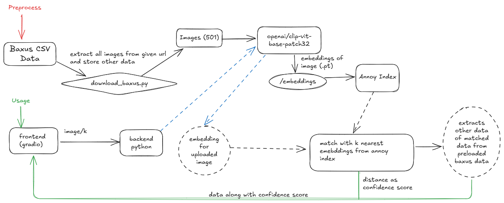
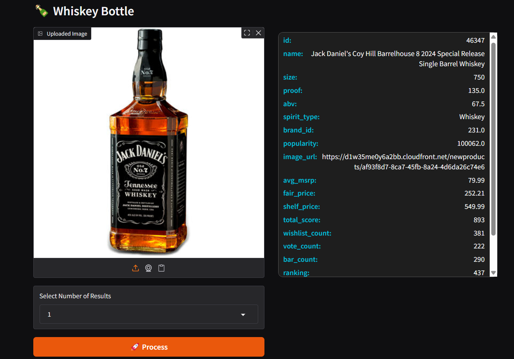
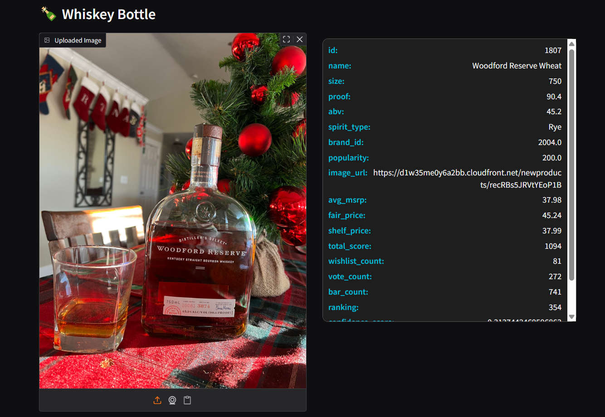

<h1 align="center"> Whiskey Googles </h1>
<div align="center">
  
</div>

[](https://badge.fury.io/py/tensorflow)
[](https://pypi.org/project/annoy/)

[](https://pypi.org/project/numpy/)
[](https://pypi.org/project/pandas/)
[](https://pypi.org/project/fastapi/)


## 📚 Table of Contents
- [Pipeline](#pipeline) 
- [Demo](#demo)
  - [DemoVideo](#demo-video)
  - [Demo1](#demo1)
  - [Demo2](#demo2)
- [Data Preparation](#data-preparation)
- [Setting project locally](#setting-up-project-locally)
  - [Setting up backend locally](#setting-up-backend)
  - [Setting up frontend locally](#setting-up-frontend)


## Pipeline


## Demo 

### Demo Video

### Demo1
This image is downloaded from internet and is not same as given in images.


### Backend Response (tried using postman)
```json
{
    "result": [
        {
            "name": "Jack Daniel's Coy Hill Barrelhouse 8 2024 Special Release Single Barrel Whiskey",
            "size": 750,
            "proof": 135.0,
            "abv": 67.5,
            "spirit_type": "Whiskey",
            "brand_id": 231.0,
            "popularity": 100062.0,
            "image_url": "https://d1w35me0y6a2bb.cloudfront.net/newproducts/af93f8d7-8ca7-45fb-8a24-4d6da26c74e6",
            "avg_msrp": 79.99,
            "fair_price": 252.21,
            "shelf_price": 549.99,
            "total_score": 893,
            "wishlist_count": 381,
            "vote_count": 222,
            "bar_count": 290,
            "ranking": 437,
            "id": 46347,
            "confidence_score": 0.6705087125301361
        }
    ]
}
```
#### Response on frontend




#### Ground Truths
This is the original image that is there in baxus dataset.


# Demo2

This image is downloaded from internet and is not same as given in images.


### Backend Response (tried using postman)
```json
{
    "result": [
        {
            "name": "Woodford Reserve Wheat",
            "size": 750,
            "proof": 90.4,
            "abv": 45.2,
            "spirit_type": "Rye",
            "brand_id": 2004.0,
            "popularity": 200.0,
            "image_url": "https://d1w35me0y6a2bb.cloudfront.net/newproducts/recRBs5JRVtYEoP1B",
            "avg_msrp": 37.98,
            "fair_price": 45.24,
            "shelf_price": 37.99,
            "total_score": 1094,
            "wishlist_count": 81,
            "vote_count": 272,
            "bar_count": 741,
            "ranking": 354,
            "id": 1807,
            "confidence_score": 0.3134232759475708
        }
    ]
}
```

### Frontend Response 



### Ground Truth 


### Data Preparation
- As baxus image has 501 images, so I have stored it and baxus_data.csv in data but if it scales and becomes more, then make **data** folder in root directory and download the google sheets as csv and store it in **data** folder.
```bash 
mkdir data
```
- Download the csv file of baxus where data is stored.
- Then run the download_baxus_data.py
```bash
python donwload_baxus_data.py
```

**If data is 501 there is no need to do anything and proceed further** 


### Setting up Project locally
```bash 
git clone https://github.com/Davda-James/Whiskey-Goggles.git
cd Whiskey-Goggles
```
- Creating a python environment
```bash
python -m venv venv
```
- Downloading requirements
```bash 
pip install -r requirements.txt
```

#### Setting up backend
```python
python src/backend.py
```
**Note: By default backend will run on  http://127.0.0.1:8000**

### Setting up frontend
```python
python src/frontend.py
```
**Note: By default frontend will run on  http://127.0.0.1:7860**


**Good to go, Enjoy using Whiskey Googles and do start the repo [Whiskey Googles](https://github.com/Davda-James/Whiskey-Goggles)**